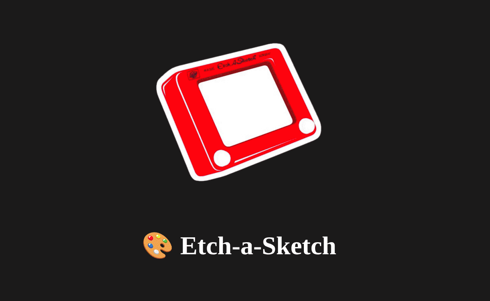

### Odin-Etch-a-Sketch

# 🎨 Etch-a-Sketch Grid Painter


Welcome to **Etch-a-Sketch**, a dynamic drawing grid that lets you sketch using color, opacity, and fun effects. Inspired by the classic toy—but reimagined with modern web technologies!


---

## ✨ Features

* 🎛️ **Adjustable Grid Size**: Create grids between 40×40 and 100×100. Only with flex-box.
* 🖌️ **Color Picker**: Choose your own color to draw with.
* 🌈 **Mixed Color Mode**: Paint with random RGB colors for every stroke.
* 🌫️ **Opacity Control**: Smooth fade effects using an opacity slider.
* 🧽 **Eraser Tool**: Clear cells with a soft eraser effect.
* 🎬 **Welcome Animation**: A short intro splash before you start.

---

## 📦 Project Structure

```plaintext
Etch-a-Sketch/
│
├── index.html         # Main HTML structure
├── script.js          # JavaScript logic (grid drawing, interactivity)
├── style.css          # Styling for layout, animation, and grid design
├── /images            # Icons and welcome image
│   ├── etch.png
│   ├── eraser.png
│   ├── mixColor.png
│   └── opacity.png
```

---

## 🚀 How to Use

1. **Clone or Download** the repository.
2. Open `index.html` in your browser.
3. Interact with the controls:

   * Set your desired grid size and click `Grid` to build.
   * Pick a color or enable random color mode.
   * Adjust opacity using the slider icon.
   * Use the eraser to clear cells.

---

## 🎮 Controls

| Tool              | Action                                  |
| ----------------- | --------------------------------------- |
| 🟦 Grid Button    | Builds a grid with custom size (40–100) |
| 🎨 Color Picker   | Changes your draw color                 |
| 🧽 Eraser Icon    | Switch to erase mode                    |
| 🌈 Mix Color Icon | Enables random RGB colors for each cell |
| 🌫️ Opacity Icon  | Shows a slider to control cell opacity  |

---

## 🎥 Demo 


---

## 🛠 Tech Stack

* HTML5
* CSS3 (with animation)
* Vanilla JavaScript (no frameworks!)

---

## 🧠 Ideas to Improve

* Add a **save drawing** feature (download canvas).
* Implement **keyboard shortcuts** for tools.
* Introduce **custom patterns or stamps**.
* Add a **dark/light theme toggle**.

---


## 📜 License

MIT License — free to use, modify, and share.

```

👤 Author

Made with ❤️ by @elan-thinks

